# Ninebot G30 ESC Modding

### Table of Contents

- [Preface](#preface)
- [Warning](#warning)
- [ESC Generations](#esc-generations)
  - [Generation 1 Overview](#generation-1-overview)
  - [Generation 2 Overview](#generation-2-overview)
- [What are we going to mod?](#what-are-we-going-to-mod)
  - [Resistors](#resistors)
  - [Capacitors](#capacitors)
  - [Mosfets](#mosfets)
  - [Conductor Tracks](#conductor-tracks)
- [Modding](#modding)
  - [Generation 1 (1 Capacitor)](#generation-1-1-capacitor)
  - [Generation 1 (3 Capacitor)](#generation-1-3-capacitor)
  - [Generation 2](#generation-2)
- [Disassembling](#disassembling)
  - [Silicon](#silicon)
  - [Capacitors](#capacitors-1)
  - [Mosfets](#mosfets-1)
  - [ADC Resistor](#adc-resistor)
- [Soldering](#soldering)
  - [ADC Resistor](#adc-resistor-1)
  - [Mosfets](#mosfets-2)
  - [Capacitors](#capacitors-2)
- [Reinforce Tracks](#reinforce-tracks)
  - [Generation 1 Tracks](#generation-1-tracks)
  - [Generation 2 Tracks](#generation-2-tracks)
  - [Copper Wire](#copper-wire)
- [Resistor Cable](#resistor-cable)
- [Example of modded ESCs](#example-of-modded-escs)
  - [Generation 1 Example](#generation-1-example)
  - [Generation 2 Example](#generation-2-example)
- [Thank You!](#thank-you)

---

### Preface

In this guide we will talk about how to mod your own ESC. We will find out how the ESCs actually work, which components specifically need to be replaced, how we reinforce conductor tracks, how we build an "Anti-spark-cable", and how we avoid short circuits. 

### Warning
Make sure to always drain your capacitors when working with your ESC. You want to do this to prevent shorts. **Step-by-step**: Plug out battery cable, leave all else cables plugged in, now turn on the scooter and wait until it turns off itself.  

⚠️ Please read the <a href="PRECAUSION.md">precausion</a> file ⚠️

---

#### ESC Generations

When it comes to the G30 ESCs, we differentiate between 3 different circuit boards, each of which is intended for different models.

### Generation 1 Overview

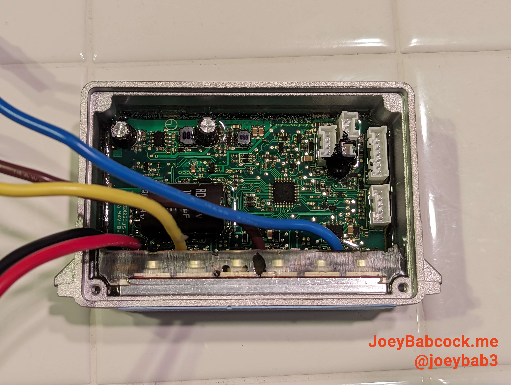
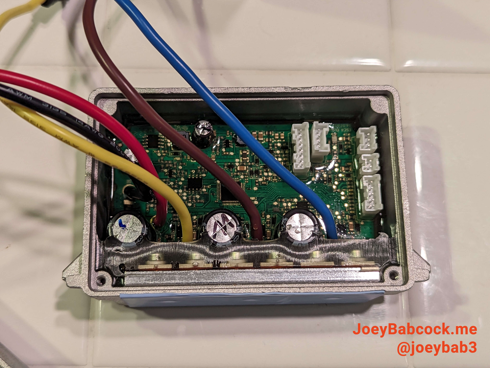
  
*Credits: <a href="https://joeybabcock.me/">Joey Babcock</a>*

The first generation ESC is based on a STM32 chip and connects to the motor via bullet connectors. Those models were invented by the end of 2019, with the release of the G30. We differientate between the 1 capacitor and the 3 capacitor version. Both ESCs are cast with a type of “silicone” to prevent incoming water damaging the board. The 3-capacitor-version can also be found in other models, but is most likely used for the German series of the G30D.

#### Generation 2 Overview

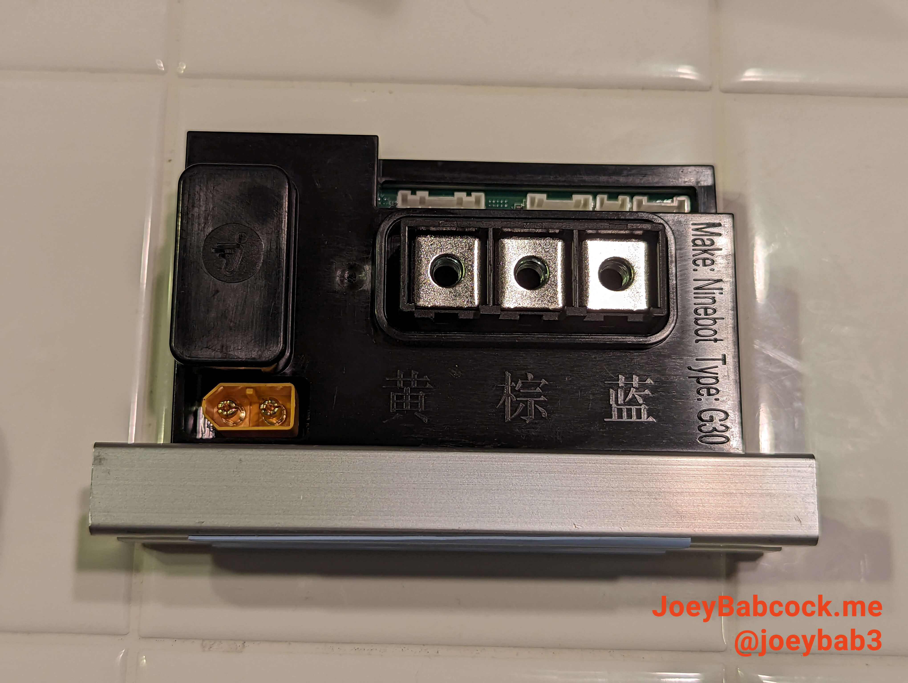

   
*Credits: <a href="https://joeybabcock.me/">Joey Babcock</a> &<a href="https://discordapp.com/users/1030601422900834345"> Stoindl</a>*

The second generation is based on the AT32 chip and connects to the motor via screwable connectors. This model was invented by the new G30 models in early 2022. The ESC is protected by a black plastic shell and therefore does not contain any silicone for water protection. In addition, the mosfets are held by a clamp, which presses the mosfets onto the housing with tension to ensure heat dissipation.

---

### What are we going to mod?

#### Resistors

 Depending on the voltage you want to apply to your ESC, you will need a specific resistor. If a resistor has a high electrical resistance, the current strength in a circuit is severely limited and only a small current flows. If a resistor has a low resistance value, a high current can flow. So how do we actually know what resistance we need for our voltage? For this case, Lekrsu has created a great <a href="https://lekrsu.github.io/shfw-walkthrough/calculator/">calculator</a> to calculate how much **Radc (Ohms)** your resistor needs to resist the voltage going through the ESC. Regarding on which value you enter, you will get the maximal voltage the resistor can resist. **For example**: 36V batteries have a maximal voltage of 42V, in this case you would need 130K Ohm.

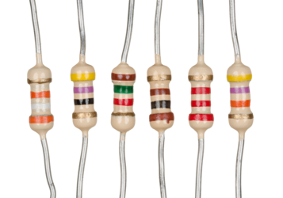
  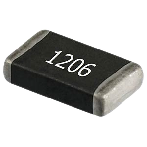 

#### Capacitors

A capacitor is a passive electrical component with the ability to statically store electrical charge and the associated energy in an electric field in a direct current circuit. For our ESC, we have large current surges, positive or negative, we need the caps to smooth out the voltage, aswell as for our e-brake. Every capacitor has a specific voltage limit, if this limit gets exceeded, it will cause the capacitor to explode.
We measure the capacitance in the unit Micro-Farad (μF), it depends on the design, dielectric and therefore the technology used. No matter how much brake-amper you will set in the end, all capacitors in total should have a capacitance of 2000uF to be on the safe-side.

 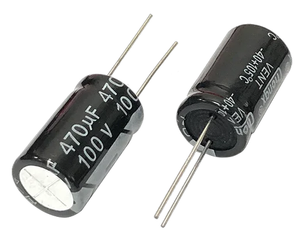 

#### Mosfets

A mosfet is a type of semiconductor transistor commonly used in electronics and digital circuits. For the ESC, the mosfets are used to transmitt the heat to the case and for controlling the motor. Mosfets have a certain voltage limit, if this is exceeded it can destroy the mosfet. Depending on how many volts you want to connect, you need mosfets to have a slightly higher volt limit, aswell as a slightly higher amper limit, than your planning to set.

 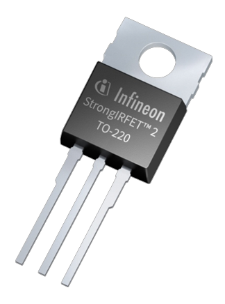 

#### Conductor Tracks

The conductor tracks are responsible for transmitting the current in the PCB to the motor Due to high amp settings this can often generate a lot of heat. In this case, copper is our best friend. Due to its high degree of melting, we don't have to worry about the conductor tracks melting or bursting. We simply solder a thick copper wire to the contacts shown and cover this with solder.

 

---
### Modding

#### Generation 1 (1 Capacitor)

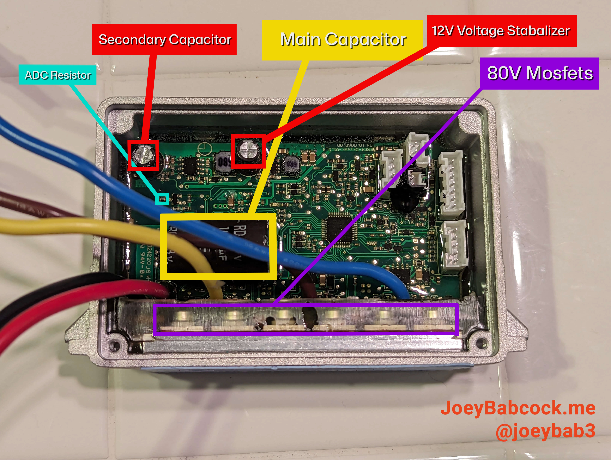 
  *Credits: <a href="https://joeybabcock.me/">Joey Babcock</a>*

#### Generation 1 (3 Capacitor)

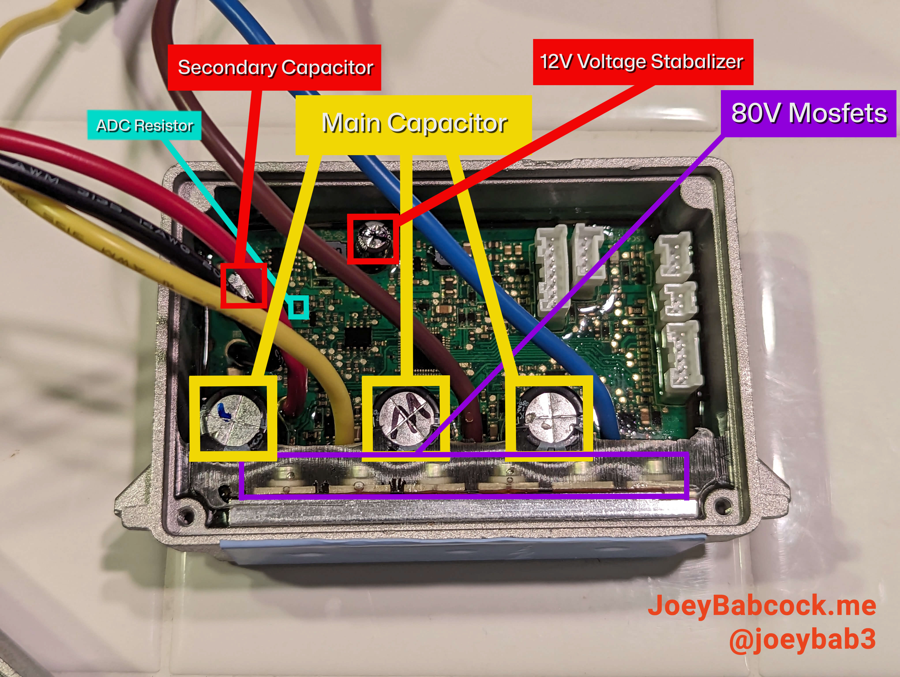 
  *Credits: <a href="https://joeybabcock.me/">Joey Babcock</a>*

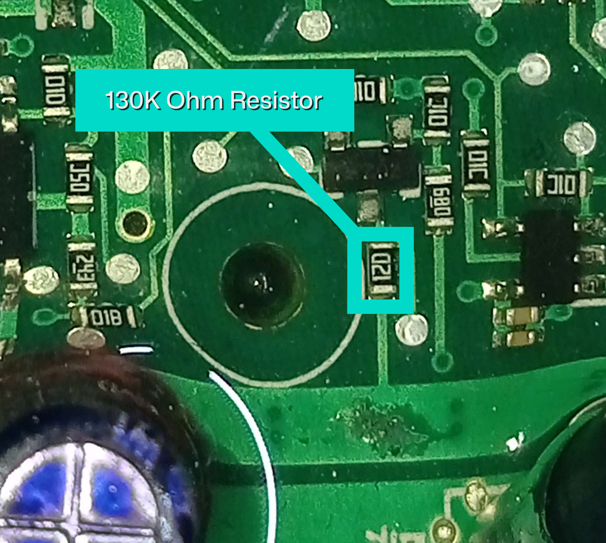

*Credits: <a href="https://discordapp.com/users/841686587463958579">Neon</a>* 

The ADC resistor is placed next to the secondary capacitor. 

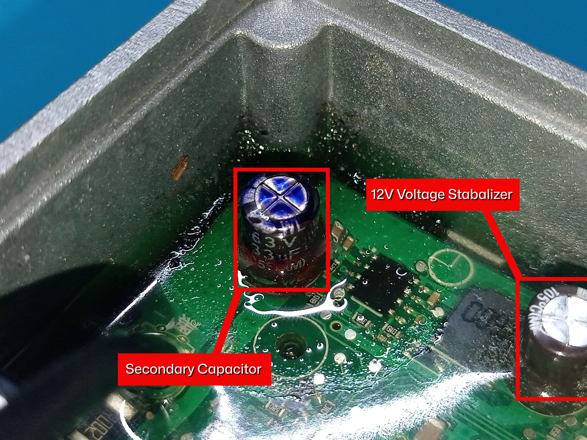 
*Credits: <a href="https://discordapp.com/users/841686587463958579">Neon</a>*

The voltage stabalizer is a stabilization for the 12V line, do NOT swap it with anything! Please swap the secondary capacitor with a capacitor that has the capacity of 33μF, higher capacity may cause problems.

#### Generation 2

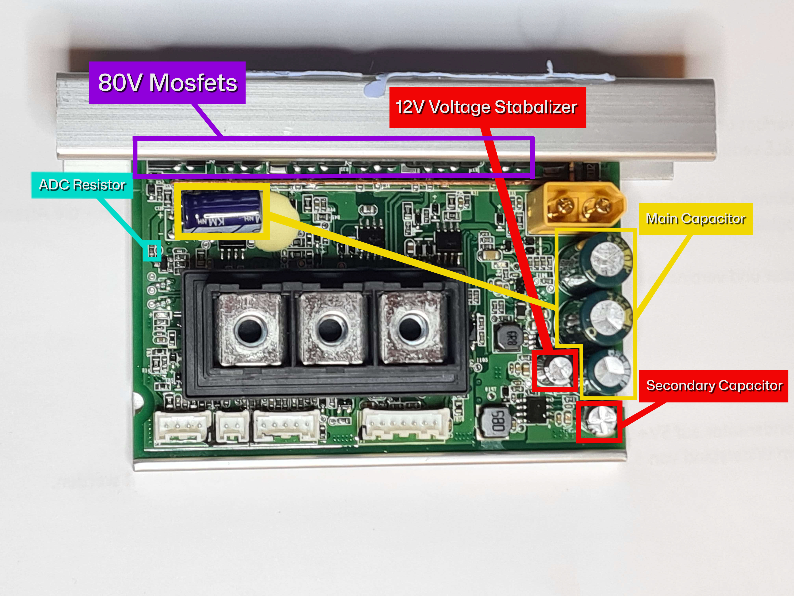 
*Credits: <a href="https://discordapp.com/users/1030601422900834345">Stoindl</a>* 

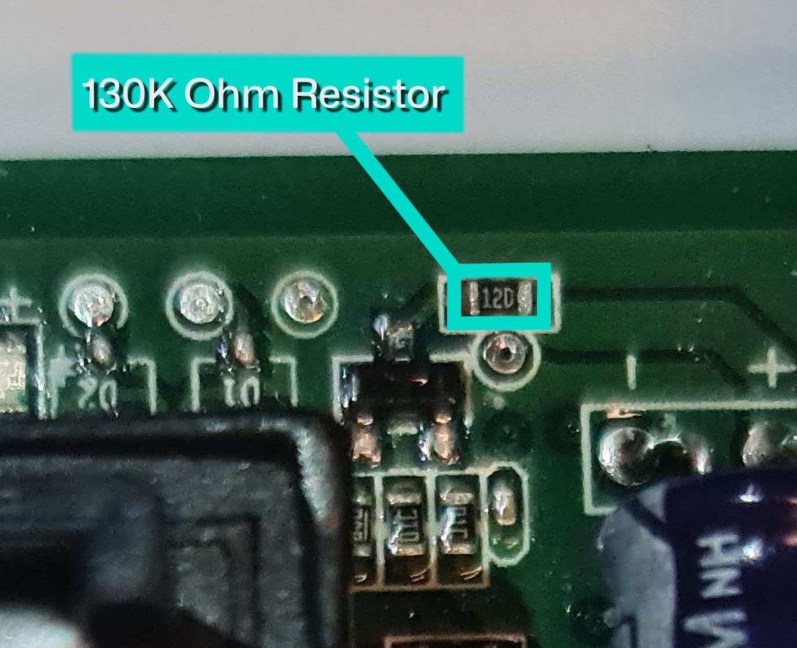 
*Credits: <a href="https://discordapp.com/users/493137101353779205">Charly-Fox</a>* 

The ADC resistor is placed next to the debug points. 

 
*Credits: <a href="https://discordapp.com/users/1030601422900834345">Stoindl</a>*

The voltage stabalizer is a stabilization for the 12V line, do NOT swap it with anything! Please swap the secondary capacitor with a capacitor that has the capacity of 33μF, higher capacity may cause problems. 
 
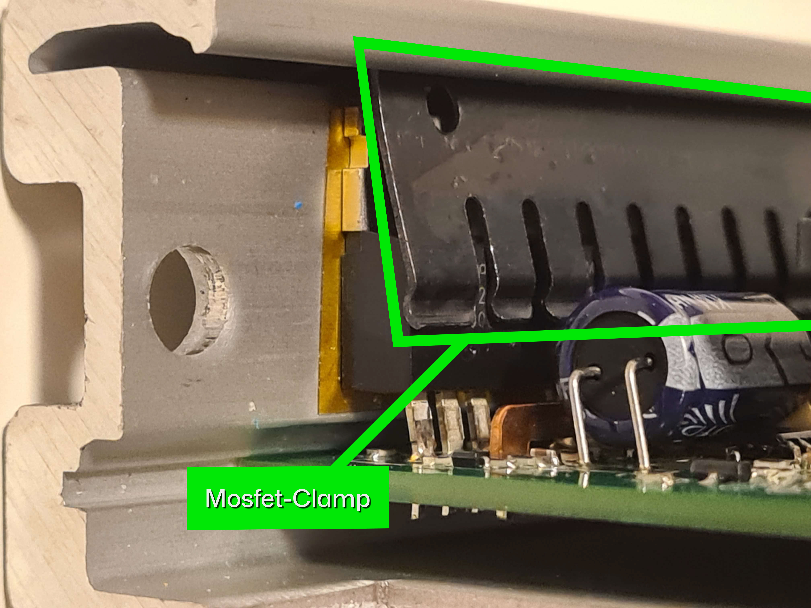
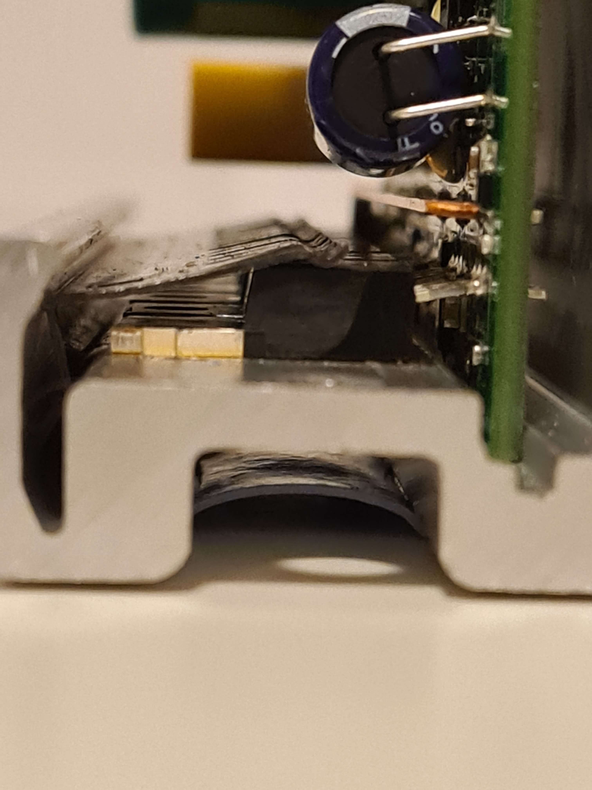 
*Credits: <a href="https://discordapp.com/users/1030601422900834345">Stoindl</a>* 

This is the mosfet clamp of the Gen2 ESC. The only way to get this clamp off is with a flathead screwdriver and a hammer. Clamp the ESC in a vise and carefully begin to hammer the clamp out to the side. You can see a example video <a href="https://imgur.com/a/pmB3rNZ">here</a>. Make sure if any metal shards have created shorts when inserted the clamp. Please bend the mosfet legs at the end so that the body rests parallel to the housing.

---

### Disassembling

Please make sure you have a little isopropernol (high proof alcohol) and a little flux, this will make the heat distribution easier. Note, that each of my paragraphs with blue color contains a tutorial that can be accessed when clicked on. Get yourself a clean work surface, you want to get your work done cleanly. 

All pictures are only examples, none of those are actually ESCs.

#### Silicon

 We start by scraping the silicone off the pads we want to solder to, use a needle or fork for this process, being careful not to damage the PCB.

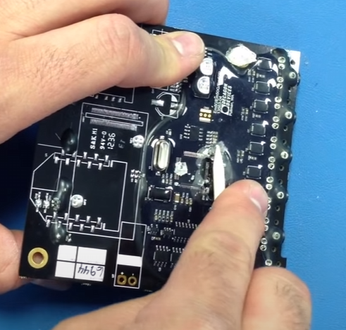 
  *Credits: <a href="https://www.youtube.com/@fellercolin">Fellercolin</a>*

#### Capacitors

**(1 Capacitor)**:  
 Next we start by unsoldering the capacitor. This can sometimes be difficult as both poles need to be heated, a suggestion would be to snap off the cap and unsolder the poles individually. Use tweezers to apply pressure to the pole while heating the pad on the back of the ESC.

**(3 Capacitor)**:  
 Start by desoldering all three capacitor, none of them can be left as they are very low voltage. It doesn't matter which of the three fields you solder new caps to, it won't make a difference. However, there is a problem here. Because the caps are soldered upways onto the PCB, there is no way to make the desoldering process easier by snapping off the poles. You now have to desolder the capacitors from below the PCB. Your only option will be to apply flux to both fields, thereby creating a heat distribution on both fields. While doing this, you will need a pressure from the other side, that pulls the capacitor away from the PCB.

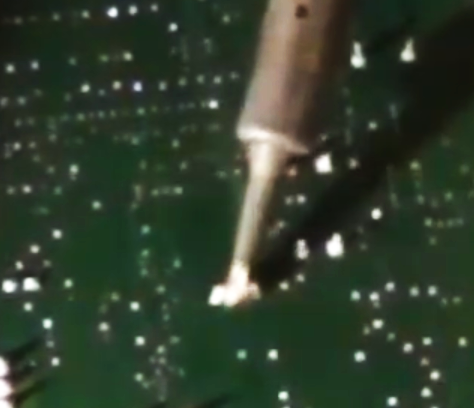 
  *Credits: <a href="https://www.youtube.com/@The231447LucidDevTeam">The231447LucidDevTeam</a>*

#### Mosfets

 It would be best to unclip the mosfets as well, as it might be difficult to heat all three points at the same time. Here too, it is recommended to use tweezers to apply pressure to the individual legs while heating the soldering point from the back.

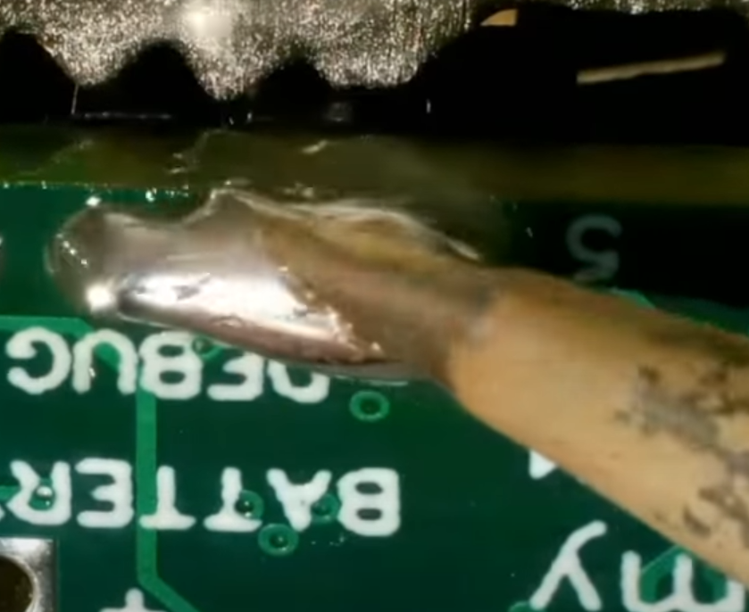 
  *Credits: <a href="https://www.youtube.com/watch?v=9jpotpIO1-U">RobertFeranec</a>*

#### ADC Resistor

 This step will only be necessary if you plan to connect more than 11s (46.2V) to your ESC! 
 Start by adding solder to both poles of the resistor. This ensures that your solder stays melted longer. In this time you need to work fast, heat the other pole of the resitsor, in order to finally remove the resistor from the PCB. Tweezers are once again ideal for this process.

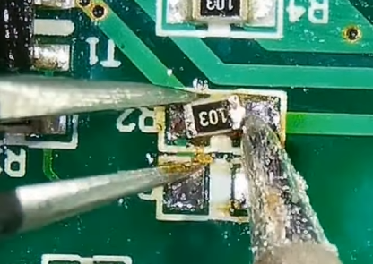 
  *Credits: <a href="https://www.youtube.com/@electronic7979">Electronic7979</a>*

---

### Soldering

#### ADC Resistor

 First things first, we start by cleaning the solder pads. Use desoldering wick and flux to remove as much solder as possible.
 You should then clean the area, using high-percentage alcohol and a cotton swab to wipe away the remaining flux. Now we come to the soldering part. We want to carry out the process quickly and cleanly. Apply a bit of solder to one of the pads, let this solder heat up and carefully position one side of the resistor into the soldering point using tweezers, surely stop to heat the solder after positioning the resistor. This will help prevent the resistor from slipping during soldering the other pole. Now you can easily apply solder to the other side, and wuolah, your resistor is successfully soldered onto your PCB.

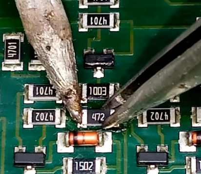 
  *Credits: <a href="https://www.youtube.com/shorts/rXJ9ICXt3zM">ElectronicsABC</a>*

#### Mosfets

For through-hole components we need clean solder holes so that we can plug the components through more easily. You should start by applying flux to all the holes, then go over them with desoldering wick to clear them. Now just stick the mosfet-legs through, and apply solder to the pads, they will then stick inside by theirselves.

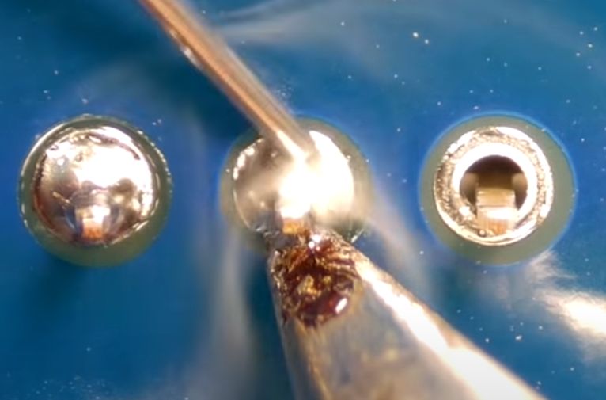 
  *Credits: <a href="https://www.youtube.com/@sdgelectronics">Sdgelectronics</a>*

#### Capacitors

We can differentiate between two types: upways and sideways.
Depending on how big your caps are and which ESC generation you have, you have to decide how to solder the caps. However, if you solder sideways, you have to calculate how exactly you have to bend the poles before soldering them.

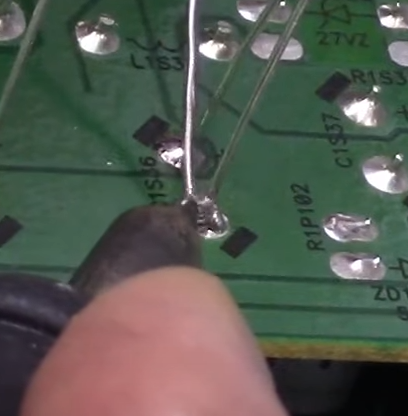 
  *Credits: <a href="https://www.youtube.com/@Rchelicopterfun">Rchelicopterfun</a>*

---

### Reinforce Tracks

In this part we will focus on the conductor tracks. Each ESC looks different from the backside. To create a higher heat limit, we will solder copper wire onto the conductor tracks, this will then be covered with solder to increase heat distribution. I have traced the copper wires in each picture, showing how they need to be soldered.

#### Generation 1 Tracks

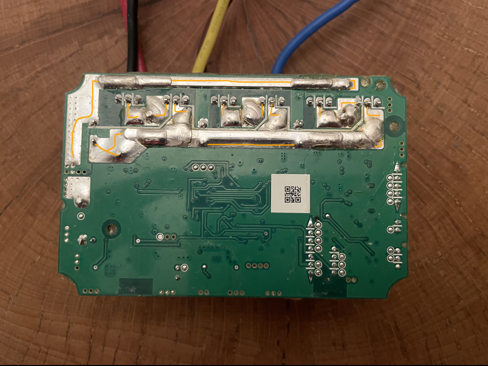

#### Generation 2 Tracks

 

#### Copper Wire

Please make sure you have the correct thickness of copper wire. You don't want your solder to melt and cause shorts when you heat the conductors through the motor. 10 Awg thickness is commonly used for this process. Please don't overdo it with the solder, we still want the PCB to fit into the case.

---

### Resistor Cable

If you've followed this guide along you might have noticed now, that as soon as you plug in your battery into your ESC, it will give a little spark. This happens by filling up the capacitors with electricity. As soon as the contacts touch eachother, the capacitors will beg for power at top speed, which creates sparking. Of course there is a solution for this too. To slow down the current that flows into the capacitors, we can work with resistors. Get a resistor that has the same value as your ADC resistor. The number of watts is unimportant, it should have around 1-3W. We want to solder this resistor into a kind of “adapter”.  

**Important**: The resistor only needs to be soldered to the positive side of the cable. The negative side can be featured by just a normal cable. Only plug in the adapter for 4-5 seconds, once the capacitors are filled, they will not ask for more. Now you can plug in your battery without worrying for upcoming sparks.

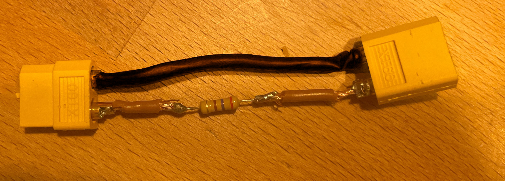

Do not forget to put a shrink tubing over your structure, we don't want to shock ourselves.

---
### Example of modded ESCs

#### Generation 1 Example

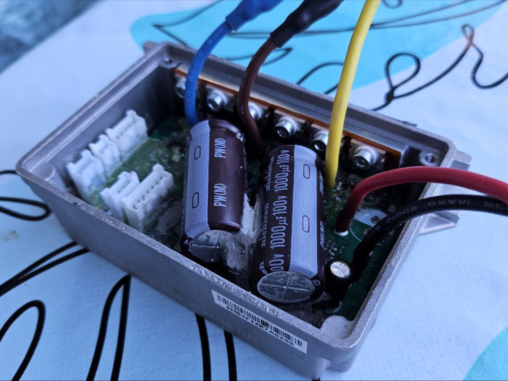 
*Credits: <a href="https://t.me/MickG90Germany">Mick Cos</a>*

#### Generation 2 Example

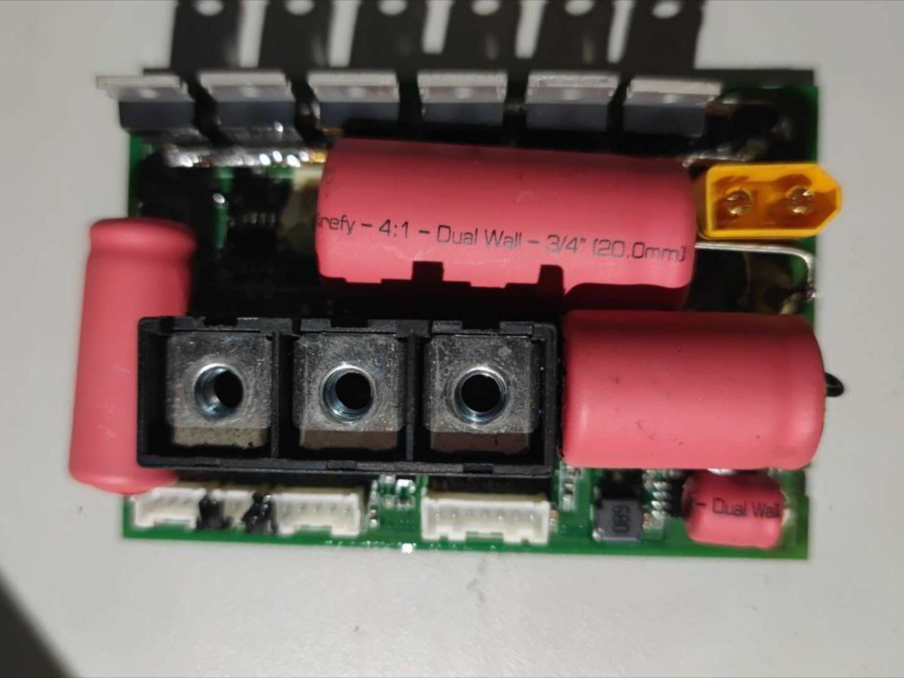 
*Credits: <a href="https://t.me/LizardDoggo">Finn</a>*

---

### Thank you!

If you've readen this far, then you should now know how to mod your ESC. I would like to thank all the people who helped me write this guide and who diligently sent me pictures. A special thanks to: 
 
<a href="https://discordapp.com/users/1030601422900834345">Stoindl</a>, for his great photos! 
<a href="https://discordapp.com/users/180730711026827267">Lekrsu</a>, for his help with GitHub! 
<a href="https://discordapp.com/users/341421282946187274">Joey Babcock</a>, for the permission to use his pictures! 
<a href="https://discordapp.com/users/841686587463958579">Neon</a>, for detailed informations about the ESCs!

This guide was written from **(03/11/2023)** to **(03/12/2023)**, and took a lot of effort. If you appreciate my work, I would be very happy about a <a href="https://www.paypal.com/donate/?hosted_button_id=JXSMGF7S8TG3Y">donation</a>.

